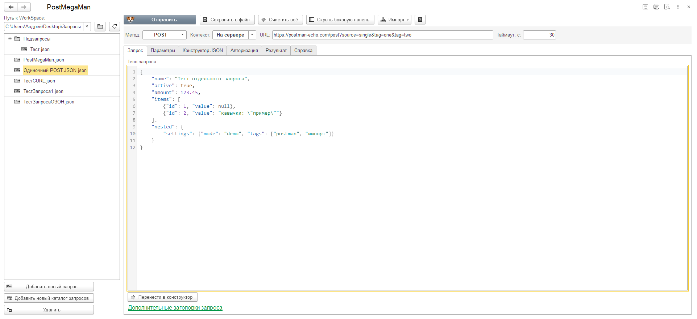
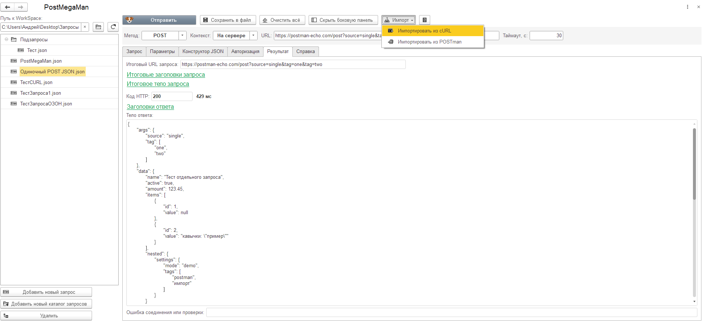
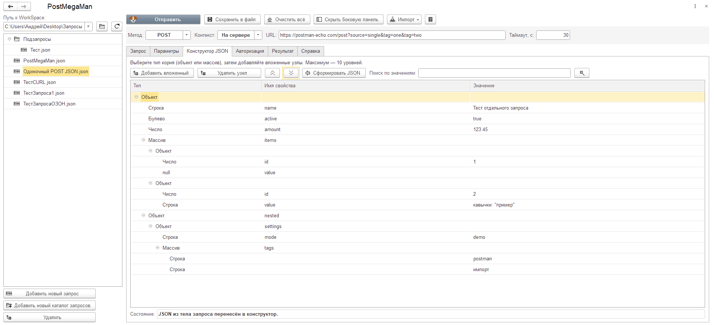
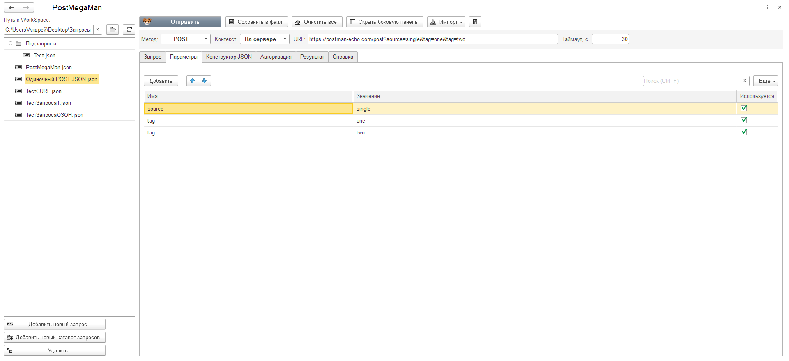

# PostMegaMan

HTTP-клиент для **1С:Предприятия** в виде внешней обработки. Отправляй запросы, проверяй API и работай с JSON прямо в 1С — без установки БСП и изменения конфигурации.

**[Скачать PostMegaMan.epf](https://github.com/SmaginAV/PostMegaMan/releases/latest)** · [Примеры импорта](examples/README.md) · [Сообщить об ошибке](https://github.com/SmaginAV/PostMegaMan/issues)

## Возможности

- Выбор HTTP-метода, заголовков и таймаута, отправка запроса и просмотр ответа.
- Выполнение HTTP **на клиенте или на сервере**. Клиентский режим предлагается при доступности в текущем сеансе.
- Авторизация **Basic, Bearer, API key и JWT**. Полученный JWT можно использовать в следующем запросе.
- Query-параметры URL: включение и отключение отдельных строк, повторяющиеся имена, автоматическая сборка URL.
- Редактор тела запроса с подсветкой JSON, номерами строк, отменой и повтором изменений.
- Конструктор JSON с вложенностью до **10 уровней**, поиском по значениям и переносом JSON в обе стороны.
- Сохранение и загрузка состояния запроса, включая авторизацию, конструктор и результаты.
- Боковая панель **WorkSpace**: каталоги запросов, создание, удаление и перемещение файлов.
- Отметка `(*)` для несохранённых изменений и предложение сохранить запрос при переключении.
- Импорт **cURL** и запросов/коллекций **Postman** в рамках поддерживаемых настроек.
- Отображение времени выполнения запроса в миллисекундах и оформление JSON-ответа с переносами строк.
- Встроенная справка по кнопке в шапке формы.

## Требования и совместимость

| Параметр | Значение |
|---|---|
| Целевая платформа | 1С:Предприятие **8.3.21 и новее** |
| Проверенная среда | **8.3.27.2074, 8.3.26.1656**, тонкий и толстый клиент, файловая и серверная базы |
| БСП | Не требуется |
| Изменение конфигурации | Не требуется |
| Установка | Открыть внешний файл `PostMegaMan.epf` |

Минимальная версия 8.3.21 отдельно не тестировалась. Работа в других видах клиента и на реальном серверном кластере этой проверкой не подтверждена. При несовместимом HTML-движке или слишком большом теле запроса редактор использует обычное текстовое поле 1С.

## Как начать

1. Открой [последний выпуск](https://github.com/SmaginAV/PostMegaMan/releases/latest) и скачай **PostMegaMan.epf** из раздела **Assets**.
2. Открой файл в 1С:Предприятии через **Файл → Открыть**.
3. Если выбран WorkSpace, открой запрос в дереве или нажми **Добавить новый запрос**.
4. Выбери метод, укажи URL. При необходимости заполни параметры, заголовки, авторизацию и тело.
5. Нажми **Отправить**. На странице **Результат** будут код HTTP, время, итоговые данные запроса и ответ.

Подробная пошаговая справка доступна в шапке обработки.

## Примеры

В папке [examples](examples/README.md) подготовлены:

- [сложная строка cURL](examples/curl-complex.txt);
- [Postman: один запрос](examples/postman-single-request.postman_collection.json);
- [Postman: дерево запросов](examples/postman-request-tree.postman_collection.json).

Примеры используют демонстрационные данные. Импорт переносит поддерживаемые параметры; настройки, которые невозможно воспроизвести, не игнорируются молча. Переменные Postman должны разрешаться из самого импортируемого файла.

## Скриншоты

Ответ сервера и время выполнения

Конструктор JSON

Параметры URL

## Хранение данных

Файлы запросов сохраняют секреты авторизации **открытым текстом**, а также тела запросов и ответов. Используй демонстрационные данные в публичных примерах, скриншотах и сообщениях об ошибках.

## Исходники

- [XML-исходники обработки](src/) — модули, формы, макеты и картинки.
- [Редактор тела запроса](src/PostMegaMan/RequestEditor/README.md) — исходники, закреплённые зависимости и описание сборки.
- [Сторонние компоненты](THIRD-PARTY-NOTICES.md) — происхождение, лицензии и исходники.

Готовый EPF распространяется через **Releases**. Архивы **Source code** содержат исходники репозитория и не заменяют файл обработки.

## Обратная связь

Ошибки и предложения можно оставить в [Issues](https://github.com/SmaginAV/PostMegaMan/issues). Укажи версию платформы, вид клиента, шаги воспроизведения и текст ошибки. Перед прикреплением запросов и скриншотов убери секреты.

Автор: [SmaginAV](https://github.com/SmaginAV).

## Лицензия

Собственный код, формы, документация и созданные для PostMegaMan иконки распространяются по [MIT](LICENSE), Copyright © 2026 SmaginAV.

Сторонний код редактора, движок Doom и игровые данные сохраняют собственные лицензии. MIT не заменяет их условия. Полный состав и область применения лицензий описаны в [THIRD-PARTY-NOTICES.md](THIRD-PARTY-NOTICES.md).
